# Wireshark Network Analysis Masterclass — Learner Guide

**Course Code:** C1123  |  **Conducted by:** Tertiary Infotech Academy Pte Ltd (UEN 201200696W)  |  **Version v5.0 · 5 October 2026**

## Contents

- [Introduction](#introduction)
- [Course Learning Outcomes](#course-learning-outcomes)
- [Before You Start — Preparation](#before-you-start--preparation)
- [Topic 01 — Introduction to Network Analysis and Wireshark](#topic-01--introduction-to-network-analysis-and-wireshark)
  - [Lab 1 — Establish a trace baseline](#lab-1--establish-a-trace-baseline)
- [Topic 02 — Capture Methods and Capture Filters](#topic-02--capture-methods-and-capture-filters)
  - [Lab 2 — Plan capture placement](#lab-2--plan-capture-placement)
- [Topic 03 — Global Preferences and Troubleshooting Profiles](#topic-03--global-preferences-and-troubleshooting-profiles)
  - [Lab 3 — Create an analyst profile](#lab-3--create-an-analyst-profile)
- [Topic 04 — Navigation and Coloring Techniques](#topic-04--navigation-and-coloring-techniques)
  - [Lab 4 — Color and annotate evidence](#lab-4--color-and-annotate-evidence)
- [Topic 05 — Time Values and Delay Types](#topic-05--time-values-and-delay-types)
  - [Lab 5 — Separate path and server delay](#lab-5--separate-path-and-server-delay)
- [Topic 06 — Trace Statistics and VoIP Overview](#topic-06--trace-statistics-and-voip-overview)
  - [Lab 6 — Summarize traffic and a voice stream](#lab-6--summarize-traffic-and-a-voice-stream)
- [Topic 07 — Display Filters](#topic-07--display-filters)
  - [Lab 7 — Build a filter evidence matrix](#lab-7--build-a-filter-evidence-matrix)
- [Topic 08 — TCP/IP Communications and Resolution](#topic-08--tcpip-communications-and-resolution)
  - [Lab 8 — Reconstruct an application dependency chain](#lab-8--reconstruct-an-application-dependency-chain)
- [Topic 09 — DNS Traffic Analysis](#topic-09--dns-traffic-analysis)
  - [Lab 9 — Diagnose DNS failure and delay](#lab-9--diagnose-dns-failure-and-delay)
- [Topic 10 — ARP Traffic Analysis](#topic-10--arp-traffic-analysis)
  - [Lab 10 — Verify link-local resolution](#lab-10--verify-link-local-resolution)
- [Topic 11 — IPv4 Traffic Analysis](#topic-11--ipv4-traffic-analysis)
  - [Lab 11 — Classify IPv4 scope and headers](#lab-11--classify-ipv4-scope-and-headers)
- [Topic 12 — ICMP Traffic Analysis](#topic-12--icmp-traffic-analysis)
  - [Lab 12 — Interpret echo and unreachable messages](#lab-12--interpret-echo-and-unreachable-messages)
- [Topic 13 — UDP Traffic Analysis](#topic-13--udp-traffic-analysis)
  - [Lab 13 — Follow datagrams and service refusal](#lab-13--follow-datagrams-and-service-refusal)
- [Topic 14 — TCP Protocol Analysis](#topic-14--tcp-protocol-analysis)
  - [Lab 14 — Investigate retransmission and zero window](#lab-14--investigate-retransmission-and-zero-window)
- [Topic 15 — Traffic Graphs](#topic-15--traffic-graphs)
  - [Lab 15 — Graph bytes, RTT and recovery](#lab-15--graph-bytes-rtt-and-recovery)
- [Topic 16 — HTTP and HTTP/2 Analysis](#topic-16--http-and-http2-analysis)
  - [Lab 16 — Inspect HTTP outcomes and HTTP/2 frames](#lab-16--inspect-http-outcomes-and-http2-frames)
- [Topic 17 — TLS-Encrypted Traffic Analysis](#topic-17--tls-encrypted-traffic-analysis)
  - [Lab 17 — Compare encrypted and decrypted views](#lab-17--compare-encrypted-and-decrypted-views)
- [Topic 18 — Ten Troubleshooting Steps and Reporting](#topic-18--ten-troubleshooting-steps-and-reporting)
  - [Lab 18 — Produce an evidence-led incident report](#lab-18--produce-an-evidence-led-incident-report)
- [Next Steps](#next-steps)
- [Glossary](#glossary)


## Introduction

This guide supports C1123, a four-day, 30-hour commercial short course. It includes detailed instructions for 18 self-contained labs using supplied synthetic packet captures.

Version 5.0 aligns the slides, this guide and the lesson plan with the Tertiary Infotech house design. Every lab ships with its own synthetic capture, templates and verification script; the Expected Evidence figure in each lab shows the packet list you should reproduce.


## Course Learning Outcomes

- LO1: Plan scoped captures and configure a reproducible analyst profile.
- LO2: Navigate, filter, summarize and time network exchanges.
- LO3: Interpret DNS, ARP, IPv4, ICMP and UDP evidence.
- LO4: Diagnose TCP and application behaviour, including HTTP and authorised TLS inspection.
- LO5: Report observed facts, hypotheses and next actions with defensible evidence.


## Before You Start — Preparation

**What you need**

- Windows or macOS laptop; Wireshark 4.6 or later from https://www.wireshark.org/download.html.
- TShark CLI tools for automated fixture checks; Python 3 for scripts. Scapy and OpenSSL only if regenerating data.
- Download the whole labs folder so captures, templates and scripts stay together.

**Verify your setup**

Confirm Wireshark opens branch-office.pcap. For command-line checks use:

```text
tshark --version
python3 --version
```

**Conventions used in every lab**

- Windows: use py -3 instead of python3. If tshark is not on PATH, use the Wireshark installation directory.
- All packet addresses and names are synthetic. The generator sends no packets.
- Steps assume you are inside the current lab folder. Clear filters between investigations.
- 4 days include 450 instructional minutes and 30 minutes of tea breaks each day; lunch is separate.


## Topic 01 — Introduction to Network Analysis and Wireshark

Establish a trace baseline

**Key concepts**

- A capture is a measurement at one observation point, not a complete network history.
- Packet list, protocol details and bytes connect a summary to the underlying evidence.
- Record interface, timestamp precision, dropped packets and capture scope before interpreting a trace.

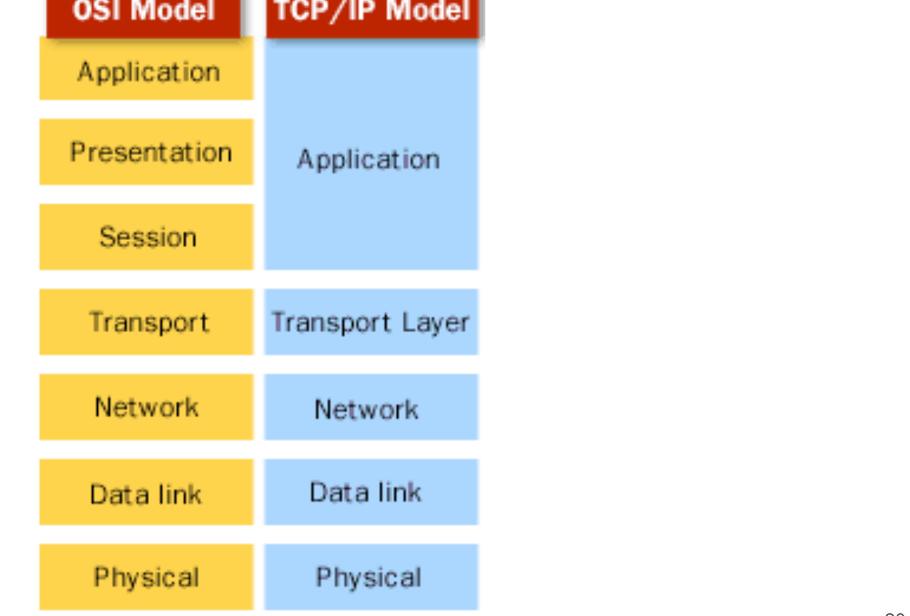

*The TCP/IP and OSI Models — OSI layers mapped to the TCP/IP model*


### Lab 1 — Establish a trace baseline

Learning outcome: LO1.

Goal: A capture is a measurement at one observation point, not a complete network history.

**What you'll build**

Evidence CSV and packet findings   (Tools: Wireshark, TShark, Python.)

**Step-by-step**

1. Prepare your lab workspace. Open this lab folder in a terminal. Windows uses py -3 in place of python3. Wireshark GUI alone is sufficient for the investigation; CLI scripts require TShark on PATH. Run the fixture verification first.

   ```text
   python3 scripts/verify.py
   ```

2. Open data/branch-office.pcap with File > Open. Clear the display filter. Record the packet count from the status bar and the capture duration from Statistics > Capture File Properties.
3. Select frame 1. Expand Ethernet II and Address Resolution Protocol in Packet Details. Click the sender IP field and observe the corresponding bytes.
4. Apply arp in the display filter toolbar. Compare request and reply sender/target IP and MAC addresses. Save the two frame numbers in outputs/findings.md.
5. Export a reproducible packet table. Record the filter, frame numbers, measurement, explanation and limitation in outputs/findings.md.

   ```text
   python3 scripts/export_evidence.py
   ```


**Test it**

The supplied arp expression matches 2 frame(s) in the specified capture. Run scripts/verify.py and compare the listed frame numbers. Keep your findings and exported table in outputs/. Explain the observed result rather than only copying a count.

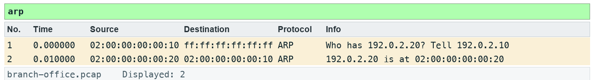

*Lab 1 expected evidence — the packet list your filter should produce*

**Troubleshooting**

TShark not found: install Wireshark CLI tools and add the installation folder to PATH; on Windows use the Wireshark install directory. A filter returns zero: clear other filters, use the specified capture, and check the expression is in the display toolbar. TLS remains opaque: select the matching lab-tls.keys file by absolute path, reload, and remove a key-log preference from another lab.

**Challenge**

Develop and explain an alternative filter.

**Reflection**

Which second observation point would strengthen your conclusion?

> **Note:** Full commands are in labs/lab-01-*/README.md. Use the README in the matching labs/lab-NN-title/ folder. Capture only with permission.

---


## Topic 02 — Capture Methods and Capture Filters

Plan capture placement

**Key concepts**

- A switched access port normally observes its own traffic and broadcasts; SPAN or TAP placement changes visibility.
- Capture filters use libpcap syntax before packets are stored; display filters hide or show stored packets.
- Bound file size and duration; check capture drops before attributing missing packets to network loss.

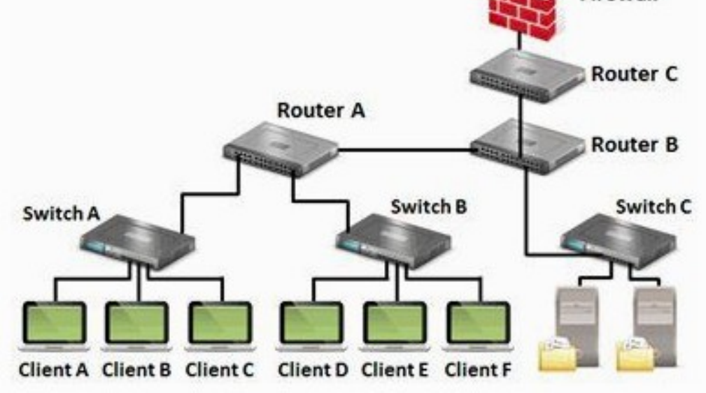

*Where to Tap Into the Network — Choose the observation point before you capture*


### Lab 2 — Plan capture placement

Learning outcome: LO1.

Goal: A switched access port normally observes its own traffic and broadcasts; SPAN or TAP placement changes visibility.

**What you'll build**

Evidence CSV and packet findings   (Tools: Wireshark, TShark, Python.)

**Step-by-step**

1. Prepare your lab workspace. Open this lab folder in a terminal. Windows uses py -3 in place of python3. Wireshark GUI alone is sufficient for the investigation; CLI scripts require TShark on PATH. Run the fixture verification first.

   ```text
   python3 scripts/verify.py
   ```

2. Open assets/topology.md. Draw a sensor on the client access port, on a mirrored uplink and beside the server. State which traffic each sees.
3. Open Capture > Options and inspect the interface list without starting a capture. Enter tcp port 80 in the capture-filter box and check syntax feedback. Cancel the dialog.
4. Open data/branch-office.pcap. Enter tcp.port == 80 in the DISPLAY toolbar. Compare the stored total with the displayed total; explain why clearing it restores hidden packets.
5. Complete assets/capture-plan.md with scope, interface, duration, ring-buffer limit and permission owner. Wireless monitor mode requires compatible adapter/driver; USB capture requires platform-specific support. Remote capture should use authorised SSH/extcap, not obsolete unauthenticated RPC instructions.
6. Export a reproducible packet table. Record the filter, frame numbers, measurement, explanation and limitation in outputs/findings.md.

   ```text
   python3 scripts/export_evidence.py
   ```


**Test it**

The supplied tcp.port == 80 expression matches 37 frame(s) in the specified capture. Run scripts/verify.py and compare the listed frame numbers. Keep your findings and exported table in outputs/. Explain the observed result rather than only copying a count.

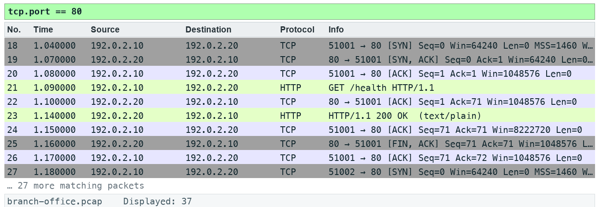

*Lab 2 expected evidence — the packet list your filter should produce*

**Troubleshooting**

TShark not found: install Wireshark CLI tools and add the installation folder to PATH; on Windows use the Wireshark install directory. A filter returns zero: clear other filters, use the specified capture, and check the expression is in the display toolbar. TLS remains opaque: select the matching lab-tls.keys file by absolute path, reload, and remove a key-log preference from another lab.

**Challenge**

Develop and explain an alternative filter.

**Reflection**

Which second observation point would strengthen your conclusion?

> **Note:** Full commands are in labs/lab-02-*/README.md. Use the README in the matching labs/lab-NN-title/ folder. Capture only with permission.

---


## Topic 03 — Global Preferences and Troubleshooting Profiles

Create an analyst profile

**Key concepts**

- A profile bundles reproducible columns, coloring rules and protocol settings.
- Name resolution can obscure numeric evidence and generate additional traffic; document the setting.
- Protocol heuristics and TCP analysis preferences change interpretation, not the stored bytes.

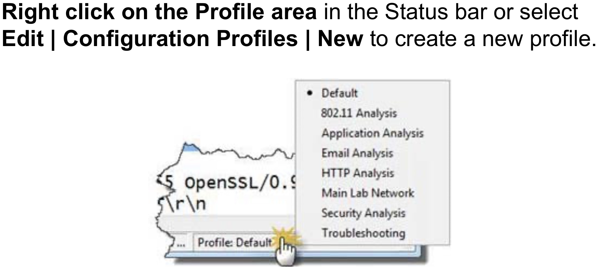

*Configuration Profiles — Right-click the Profile area in the status bar to switch or create*


### Lab 3 — Create an analyst profile

Learning outcome: LO1.

Goal: A profile bundles reproducible columns, coloring rules and protocol settings.

**What you'll build**

Evidence CSV and packet findings   (Tools: Wireshark, TShark, Python.)

**Step-by-step**

1. Prepare your lab workspace. Open this lab folder in a terminal. Windows uses py -3 in place of python3. Wireshark GUI alone is sufficient for the investigation; CLI scripts require TShark on PATH. Run the fixture verification first.

   ```text
   python3 scripts/verify.py
   ```

2. Create a profile named C1123-Analyst using Edit > Configuration Profiles. Keep the original profile available.
3. Open data/branch-office.pcap. Disable network name resolution in View > Name Resolution. Record numeric client, server and resolver IP addresses.
4. Select a TCP packet. Expand TCP and right-click Stream index > Apply as Column. Add frame.time_delta_displayed as a custom column using Preferences > Appearance > Columns.
5. Apply dns and inspect the profile name and displayed columns. Copy the profile folder path from Help > About Wireshark > Folders into outputs/findings.md. Export or copy your profile to outputs/profile/ without overwriting a colleague profile.
6. Export a reproducible packet table. Record the filter, frame numbers, measurement, explanation and limitation in outputs/findings.md.

   ```text
   python3 scripts/export_evidence.py
   ```


**Test it**

The supplied dns expression matches 6 frame(s) in the specified capture. Run scripts/verify.py and compare the listed frame numbers. Keep your findings and exported table in outputs/. Explain the observed result rather than only copying a count.


*Lab 3 expected evidence — the packet list your filter should produce*

**Troubleshooting**

TShark not found: install Wireshark CLI tools and add the installation folder to PATH; on Windows use the Wireshark install directory. A filter returns zero: clear other filters, use the specified capture, and check the expression is in the display toolbar. TLS remains opaque: select the matching lab-tls.keys file by absolute path, reload, and remove a key-log preference from another lab.

**Challenge**

Develop and explain an alternative filter.

**Reflection**

Which second observation point would strengthen your conclusion?

> **Note:** Full commands are in labs/lab-03-*/README.md. Use the README in the matching labs/lab-NN-title/ folder. Capture only with permission.

---


## Topic 04 — Navigation and Coloring Techniques

Color and annotate evidence

**Key concepts**

- Color rules are applied in order; the first matching rule wins.
- Temporary coloring is useful for a conversation; permanent rules support repeated triage.
- Bookmarks and comments preserve the analyst path without changing the captured payload.

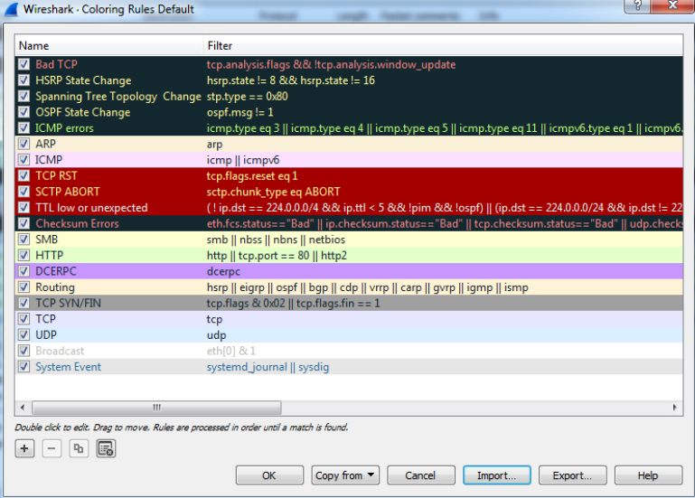

*Colouring Rules — The coloring rules list is processed in order*


### Lab 4 — Color and annotate evidence

Learning outcome: LO1.

Goal: Color rules are applied in order; the first matching rule wins.

**What you'll build**

Evidence CSV and packet findings   (Tools: Wireshark, TShark, Python.)

**Step-by-step**

1. Prepare your lab workspace. Open this lab folder in a terminal. Windows uses py -3 in place of python3. Wireshark GUI alone is sufficient for the investigation; CLI scripts require TShark on PATH. Run the fixture verification first.

   ```text
   python3 scripts/verify.py
   ```

2. Open data/branch-office.pcap. Apply http.response.code >= 400. Record the 404 and 500 frame numbers.
3. Open View > Coloring Rules. Add LAB HTTP Error with expression http.response.code >= 400, dark text and a pale amber background. Move it above a general HTTP rule.
4. Select the 500 response, mark it using Edit > Mark/Unmark Packet and add a packet comment describing the observed status only. Save As outputs/annotated.pcapng to preserve comments.
5. Clear the filter. Use Edit > Find Packet with Display filter http.response.code == 500. Reopen the saved pcapng and confirm the comment persists.
6. Export a reproducible packet table. Record the filter, frame numbers, measurement, explanation and limitation in outputs/findings.md.

   ```text
   python3 scripts/export_evidence.py
   ```


**Test it**

The supplied http.response.code >= 400 expression matches 2 frame(s) in the specified capture. Run scripts/verify.py and compare the listed frame numbers. Keep your findings and exported table in outputs/. Explain the observed result rather than only copying a count.

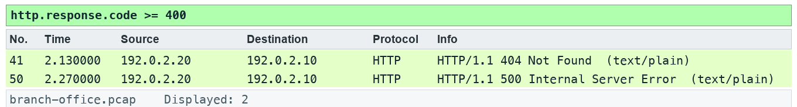

*Lab 4 expected evidence — the packet list your filter should produce*

**Troubleshooting**

TShark not found: install Wireshark CLI tools and add the installation folder to PATH; on Windows use the Wireshark install directory. A filter returns zero: clear other filters, use the specified capture, and check the expression is in the display toolbar. TLS remains opaque: select the matching lab-tls.keys file by absolute path, reload, and remove a key-log preference from another lab.

**Challenge**

Develop and explain an alternative filter.

**Reflection**

Which second observation point would strengthen your conclusion?

> **Note:** Full commands are in labs/lab-04-*/README.md. Use the README in the matching labs/lab-NN-title/ folder. Capture only with permission.

---


## Topic 05 — Time Values and Delay Types

Separate path and server delay

**Key concepts**

- Displayed delta depends on the current filter; capture delta does not.
- SYN to SYN/ACK gives an initial path-related sample; request to response includes application processing.
- One-sided timestamps cannot identify exactly which intermediate device delayed or dropped a packet.

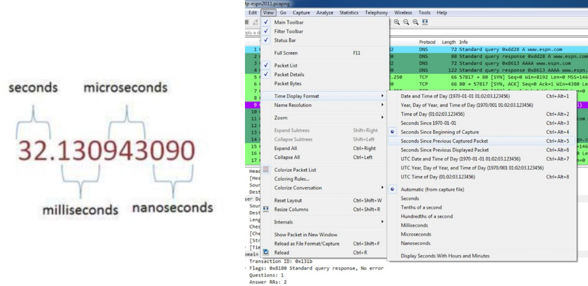

*Time Display Formats — Precision depends on the capture hardware and file format*


### Lab 5 — Separate path and server delay

Learning outcome: LO2.

Goal: Displayed delta depends on the current filter; capture delta does not.

**What you'll build**

Evidence CSV and packet findings   (Tools: Wireshark, TShark, Python.)

**Step-by-step**

1. Prepare your lab workspace. Open this lab folder in a terminal. Windows uses py -3 in place of python3. Wireshark GUI alone is sufficient for the investigation; CLI scripts require TShark on PATH. Run the fixture verification first.

   ```text
   python3 scripts/verify.py
   ```

2. Open data/branch-office.pcap. Apply tcp.stream == 1. Expand TCP in the final handshake ACK and inspect tcp.analysis.initial_rtt: 0.040 seconds. Separately measure SYN to SYN/ACK by setting a time reference on the SYN: 0.030 seconds.
3. Locate GET /slow and its HTTP response. Set a new time reference on the request. Record the response delta: 0.760 seconds, including 0.010 seconds to the server ACK and 0.750 seconds thereafter.
4. Apply http.request.uri == "/slow" || http.response.code == 200 and compare frame.time_delta with frame.time_delta_displayed on the filtered list. Explain why a displayed gap can span hidden packets.
5. Write a hypothesis in outputs/findings.md: slow response with a synthetic 30 ms SYN-to-SYN/ACK interval and 40 ms complete handshake. Name a second observation point required to distinguish processing from a later path delay.
6. Export a reproducible packet table. Record the filter, frame numbers, measurement, explanation and limitation in outputs/findings.md.

   ```text
   python3 scripts/export_evidence.py
   ```


**Test it**

The supplied http.request.uri == "/slow" || http.response.code == 200 expression matches 3 frame(s) in the specified capture. Run scripts/verify.py and compare the listed frame numbers. Keep your findings and exported table in outputs/. Explain the observed result rather than only copying a count.

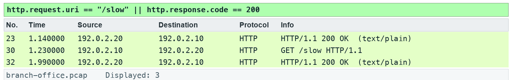

*Lab 5 expected evidence — the packet list your filter should produce*

**Troubleshooting**

TShark not found: install Wireshark CLI tools and add the installation folder to PATH; on Windows use the Wireshark install directory. A filter returns zero: clear other filters, use the specified capture, and check the expression is in the display toolbar. TLS remains opaque: select the matching lab-tls.keys file by absolute path, reload, and remove a key-log preference from another lab.

**Challenge**

Develop and explain an alternative filter.

**Reflection**

Which second observation point would strengthen your conclusion?

> **Note:** Full commands are in labs/lab-05-*/README.md. Use the README in the matching labs/lab-NN-title/ folder. Capture only with permission.

---


## Topic 06 — Trace Statistics and VoIP Overview

Summarize traffic and a voice stream

**Key concepts**

- Protocol Hierarchy shows captured composition; byte share differs from packet share.
- Conversations and Endpoints identify concentration; they do not alone prove malicious activity.
- SIP signals a call while RTP carries media; jitter, loss and codec interpretation need stream context.

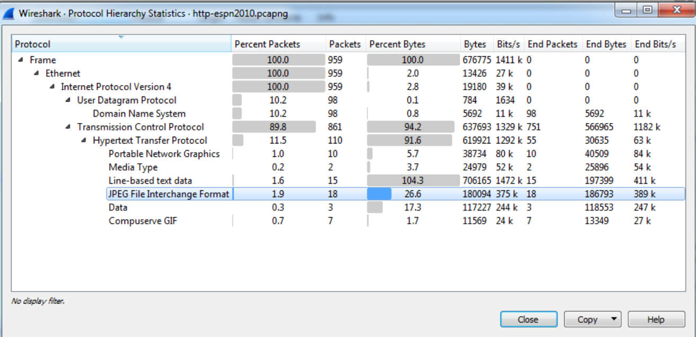

*Capture File Properties — Statistics | Protocol Hierarchy shows the protocol mix*


### Lab 6 — Summarize traffic and a voice stream

Learning outcome: LO2.

Goal: Protocol Hierarchy shows captured composition; byte share differs from packet share.

**What you'll build**

Evidence CSV and packet findings   (Tools: Wireshark, TShark, Python.)

**Step-by-step**

1. Prepare your lab workspace. Open this lab folder in a terminal. Windows uses py -3 in place of python3. Wireshark GUI alone is sufficient for the investigation; CLI scripts require TShark on PATH. Run the fixture verification first.

   ```text
   python3 scripts/verify.py
   ```

2. Open data/branch-office.pcap. Open Statistics > Protocol Hierarchy, then Statistics > Conversations. Sort TCP conversations by bytes; save the largest conversation details.
3. Open Statistics > I/O Graphs. Create an all-traffic graph with a 1 second interval and Bits as the unit. Record peak interval and explain the difference between observed bits and usable application throughput.
4. Apply sip and open Telephony > VoIP Calls or SIP Flows. Identify the INVITE and 200 OK. This minimal synthetic exchange is signalling evidence, not a complete production call.
5. Apply udp.port == 4002. Use Analyze > Decode As to decode this UDP port as RTP. Open Telephony > RTP > RTP Streams, select the stream and Analyze. Record sequence numbers 100, 101, 103, 104; the missing sequence is 102.
6. Export a reproducible packet table. Record the filter, frame numbers, measurement, explanation and limitation in outputs/findings.md.

   ```text
   python3 scripts/export_evidence.py
   ```


**Test it**

The supplied sip expression matches 2 frame(s) in the specified capture. Run scripts/verify.py and compare the listed frame numbers. Keep your findings and exported table in outputs/. Explain the observed result rather than only copying a count.


*Lab 6 expected evidence — the packet list your filter should produce*

**Troubleshooting**

TShark not found: install Wireshark CLI tools and add the installation folder to PATH; on Windows use the Wireshark install directory. A filter returns zero: clear other filters, use the specified capture, and check the expression is in the display toolbar. TLS remains opaque: select the matching lab-tls.keys file by absolute path, reload, and remove a key-log preference from another lab.

**Challenge**

Develop and explain an alternative filter.

**Reflection**

Which second observation point would strengthen your conclusion?

> **Note:** Full commands are in labs/lab-06-*/README.md. Use the README in the matching labs/lab-NN-title/ folder. Capture only with permission.

---


## Topic 07 — Display Filters

Build a filter evidence matrix

**Key concepts**

- Parentheses make mixed and/or expressions explicit.
- Field existence and Boolean equality differ: tcp.flags.syn == 1 tests the bit.
- Since Wireshark 3.6, != uses all-not-equal semantics; historical slides describing any-not-equal are obsolete.

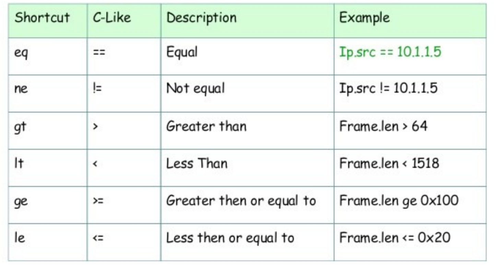

*Display Filter Operators — Comparison operators with C-like and English forms*


### Lab 7 — Build a filter evidence matrix

Learning outcome: LO2.

Goal: Parentheses make mixed and/or expressions explicit.

**What you'll build**

Evidence CSV and packet findings   (Tools: Wireshark, TShark, Python.)

**Step-by-step**

1. Prepare your lab workspace. Open this lab folder in a terminal. Windows uses py -3 in place of python3. Wireshark GUI alone is sufficient for the investigation; CLI scripts require TShark on PATH. Run the fixture verification first.

   ```text
   python3 scripts/verify.py
   ```

2. Open data/branch-office.pcap. Apply dns.flags.rcode == 3 and record the returned response frame. Clear the filter and apply tcp.flags.syn == 1.
3. Compare (ip.src == 192.0.2.10 && udp.port == 53) || tcp.port == 80 with ip.src == 192.0.2.10 && (udp.port == 53 || tcp.port == 80). Record both counts and the direction excluded by the second expression.
4. Apply !(ip.addr == 192.0.2.53). Verify that DNS packets disappear; compare ip.addr != 192.0.2.53 on Wireshark 4.6 or later. Record the actual version and equality behaviour.
5. Save five useful filters in outputs/filters.txt. For each, state the question, filter and matching frame numbers; compile them with scripts/verify.py.
6. Export a reproducible packet table. Record the filter, frame numbers, measurement, explanation and limitation in outputs/findings.md.

   ```text
   python3 scripts/export_evidence.py
   ```


**Test it**

The supplied dns.flags.rcode == 3 expression matches 1 frame(s) in the specified capture. Run scripts/verify.py and compare the listed frame numbers. Keep your findings and exported table in outputs/. Explain the observed result rather than only copying a count.


*Lab 7 expected evidence — the packet list your filter should produce*

**Troubleshooting**

TShark not found: install Wireshark CLI tools and add the installation folder to PATH; on Windows use the Wireshark install directory. A filter returns zero: clear other filters, use the specified capture, and check the expression is in the display toolbar. TLS remains opaque: select the matching lab-tls.keys file by absolute path, reload, and remove a key-log preference from another lab.

**Challenge**

Develop and explain an alternative filter.

**Reflection**

Which second observation point would strengthen your conclusion?

> **Note:** Full commands are in labs/lab-07-*/README.md. Use the README in the matching labs/lab-NN-title/ folder. Capture only with permission.

---


## Topic 08 — TCP/IP Communications and Resolution

Reconstruct an application dependency chain

**Key concepts**

- ARP resolves a local next-hop MAC; DNS resolves a name to an address.
- The destination IP stays end-to-end across routing while link-layer addresses change per hop.
- Resolution, connection establishment and application exchange form a dependency chain.

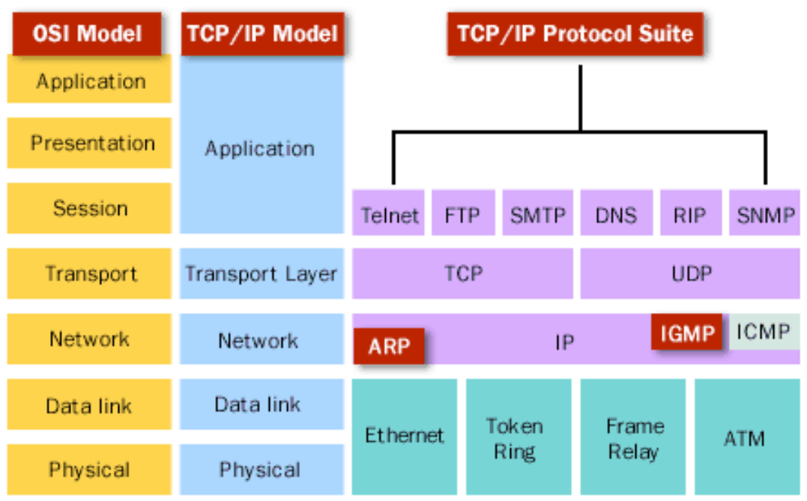

*The TCP/IP Protocol Suite — Where common protocols sit*


### Lab 8 — Reconstruct an application dependency chain

Learning outcome: LO2.

Goal: ARP resolves a local next-hop MAC; DNS resolves a name to an address.

**What you'll build**

Evidence CSV and packet findings   (Tools: Wireshark, TShark, Python.)

**Step-by-step**

1. Prepare your lab workspace. Open this lab folder in a terminal. Windows uses py -3 in place of python3. Wireshark GUI alone is sufficient for the investigation; CLI scripts require TShark on PATH. Run the fixture verification first.

   ```text
   python3 scripts/verify.py
   ```

2. Open data/branch-office.pcap. Locate the ARP exchange and DNS transaction 101 for portal.example.test. Record the server address 192.0.2.20.
3. Apply tcp.stream == 0 and open Statistics > Flow Graph with displayed packets selected. Identify SYN, SYN/ACK, ACK, request and response.
4. Fill assets/dependency-map.md with the ARP, DNS, TCP and HTTP frame ranges. Distinguish Ethernet next hop from IP destination.
5. Contrast a same-subnet server with a routed server using assets/topology.md: a routed destination needs the gateway MAC rather than ARP for the remote host. Record what this trace can and cannot demonstrate.
6. Export a reproducible packet table. Record the filter, frame numbers, measurement, explanation and limitation in outputs/findings.md.

   ```text
   python3 scripts/export_evidence.py
   ```


**Test it**

The supplied dns.qry.name == "portal.example.test" expression matches 2 frame(s) in the specified capture. Run scripts/verify.py and compare the listed frame numbers. Keep your findings and exported table in outputs/. Explain the observed result rather than only copying a count.


*Lab 8 expected evidence — the packet list your filter should produce*

**Troubleshooting**

TShark not found: install Wireshark CLI tools and add the installation folder to PATH; on Windows use the Wireshark install directory. A filter returns zero: clear other filters, use the specified capture, and check the expression is in the display toolbar. TLS remains opaque: select the matching lab-tls.keys file by absolute path, reload, and remove a key-log preference from another lab.

**Challenge**

Develop and explain an alternative filter.

**Reflection**

Which second observation point would strengthen your conclusion?

> **Note:** Full commands are in labs/lab-08-*/README.md. Use the README in the matching labs/lab-NN-title/ folder. Capture only with permission.

---


## Topic 09 — DNS Traffic Analysis

Diagnose DNS failure and delay

**Key concepts**

- Transaction ID plus addresses and ports pair a query with its response.
- NXDOMAIN reports that a name does not exist; it differs from silence or timeout.
- DNS response time is a measured exchange, influenced by resolver and path behaviour.

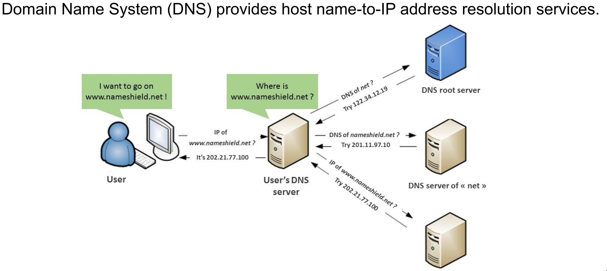

*How DNS Works — Name resolution through a local resolver*


### Lab 9 — Diagnose DNS failure and delay

Learning outcome: LO3.

Goal: Transaction ID plus addresses and ports pair a query with its response.

**What you'll build**

Evidence CSV and packet findings   (Tools: Wireshark, TShark, Python.)

**Step-by-step**

1. Prepare your lab workspace. Open this lab folder in a terminal. Windows uses py -3 in place of python3. Wireshark GUI alone is sufficient for the investigation; CLI scripts require TShark on PATH. Run the fixture verification first.

   ```text
   python3 scripts/verify.py
   ```

2. Open data/branch-office.pcap. Apply dns and add dns.time as a column from a response packet. Pair IDs 101, 102 and 103.
3. Apply dns.flags.rcode == 3. Expand DNS flags and name. Record missing.example.test and explain NXDOMAIN.
4. Apply dns.id == 103. Measure the query-response interval: 0.800 seconds. Compare with the two 0.020 second transactions.
5. Complete assets/dns-observations.csv with name, transaction ID, rcode, elapsed seconds and next investigation. Do not label this measured delay as a DNS timeout.
6. Export a reproducible packet table. Record the filter, frame numbers, measurement, explanation and limitation in outputs/findings.md.

   ```text
   python3 scripts/export_evidence.py
   ```


**Test it**

The supplied dns.flags.rcode == 3 expression matches 1 frame(s) in the specified capture. Run scripts/verify.py and compare the listed frame numbers. Keep your findings and exported table in outputs/. Explain the observed result rather than only copying a count.


*Lab 9 expected evidence — the packet list your filter should produce*

**Troubleshooting**

TShark not found: install Wireshark CLI tools and add the installation folder to PATH; on Windows use the Wireshark install directory. A filter returns zero: clear other filters, use the specified capture, and check the expression is in the display toolbar. TLS remains opaque: select the matching lab-tls.keys file by absolute path, reload, and remove a key-log preference from another lab.

**Challenge**

Develop and explain an alternative filter.

**Reflection**

Which second observation point would strengthen your conclusion?

> **Note:** Full commands are in labs/lab-09-*/README.md. Use the README in the matching labs/lab-NN-title/ folder. Capture only with permission.

---


## Topic 10 — ARP Traffic Analysis

Verify link-local resolution

**Key concepts**

- ARP requests are link-local broadcasts; replies usually return to the requester.
- A repeated unresolved request suggests a local resolution problem, but a single trace may miss the reply.
- MAC changes require corroboration before claiming duplicate IP or spoofing.


### Lab 10 — Verify link-local resolution

Learning outcome: LO3.

Goal: ARP requests are link-local broadcasts; replies usually return to the requester.

**What you'll build**

Evidence CSV and packet findings   (Tools: Wireshark, TShark, Python.)

**Step-by-step**

1. Prepare your lab workspace. Open this lab folder in a terminal. Windows uses py -3 in place of python3. Wireshark GUI alone is sufficient for the investigation; CLI scripts require TShark on PATH. Run the fixture verification first.

   ```text
   python3 scripts/verify.py
   ```

2. Open data/branch-office.pcap. Apply arp. Expand the request and reply, then record sender IP, sender MAC, target IP and opcode.
3. Apply arp.opcode == 2. Confirm the advertised server mapping is 192.0.2.20 to 02:00:00:00:00:20.
4. Use the packet bytes to verify the opcode field is 2 in the reply. Add the mapping to assets/arp-table.csv.
5. Compare assets/arp-hypotheses.md with the evidence. State that this capture shows one successful exchange, without inventing repeated failures or conflicting MACs.
6. Export a reproducible packet table. Record the filter, frame numbers, measurement, explanation and limitation in outputs/findings.md.

   ```text
   python3 scripts/export_evidence.py
   ```


**Test it**

The supplied arp.opcode == 2 expression matches 1 frame(s) in the specified capture. Run scripts/verify.py and compare the listed frame numbers. Keep your findings and exported table in outputs/. Explain the observed result rather than only copying a count.

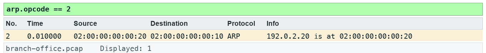

*Lab 10 expected evidence — the packet list your filter should produce*

**Troubleshooting**

TShark not found: install Wireshark CLI tools and add the installation folder to PATH; on Windows use the Wireshark install directory. A filter returns zero: clear other filters, use the specified capture, and check the expression is in the display toolbar. TLS remains opaque: select the matching lab-tls.keys file by absolute path, reload, and remove a key-log preference from another lab.

**Challenge**

Develop and explain an alternative filter.

**Reflection**

Which second observation point would strengthen your conclusion?

> **Note:** Full commands are in labs/lab-10-*/README.md. Use the README in the matching labs/lab-NN-title/ folder. Capture only with permission.

---


## Topic 11 — IPv4 Traffic Analysis

Classify IPv4 scope and headers

**Key concepts**

- TTL limits forwarding hops; it is not a latency measurement.
- Broadcast and multicast use different addressing scopes and delivery rules.
- Fragmentation fields describe packet handling; missing fragments can reflect capture limitations.

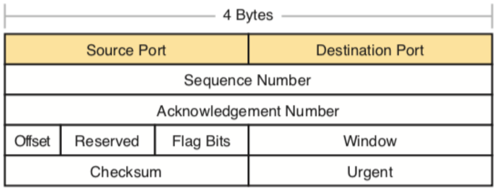

*IPv4 Header Essentials — Header layout (TCP header shown; IPv4 uses the same 32-bit rows)*


### Lab 11 — Classify IPv4 scope and headers

Learning outcome: LO3.

Goal: TTL limits forwarding hops; it is not a latency measurement.

**What you'll build**

Evidence CSV and packet findings   (Tools: Wireshark, TShark, Python.)

**Step-by-step**

1. Prepare your lab workspace. Open this lab folder in a terminal. Windows uses py -3 in place of python3. Wireshark GUI alone is sufficient for the investigation; CLI scripts require TShark on PATH. Run the fixture verification first.

   ```text
   python3 scripts/verify.py
   ```

2. Open data/branch-office.pcap. Select an ICMP echo request. Expand IPv4 and record version, IHL, total length, TTL, protocol, flags and fragment offset.
3. Apply ip.dst == 224.0.0.1 and compare Ethernet destination 01:00:5e:00:00:01 with IPv4 multicast destination. Record TTL 1.
4. Apply ip.flags.mf == 1 || ip.frag_offset > 0. Confirm no fragmented packets in this fixture; absence here does not demonstrate a universal MTU.
5. Complete assets/ip-header.csv. Explain why ARP broadcast is not an IPv4 broadcast packet, and why a capture at one point cannot estimate hop count from TTL without knowing initial TTL.
6. Export a reproducible packet table. Record the filter, frame numbers, measurement, explanation and limitation in outputs/findings.md.

   ```text
   python3 scripts/export_evidence.py
   ```


**Test it**

The supplied ip.dst == 224.0.0.1 expression matches 1 frame(s) in the specified capture. Run scripts/verify.py and compare the listed frame numbers. Keep your findings and exported table in outputs/. Explain the observed result rather than only copying a count.

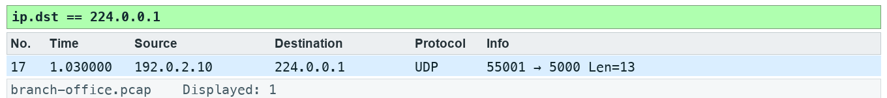

*Lab 11 expected evidence — the packet list your filter should produce*

**Troubleshooting**

TShark not found: install Wireshark CLI tools and add the installation folder to PATH; on Windows use the Wireshark install directory. A filter returns zero: clear other filters, use the specified capture, and check the expression is in the display toolbar. TLS remains opaque: select the matching lab-tls.keys file by absolute path, reload, and remove a key-log preference from another lab.

**Challenge**

Develop and explain an alternative filter.

**Reflection**

Which second observation point would strengthen your conclusion?

> **Note:** Full commands are in labs/lab-11-*/README.md. Use the README in the matching labs/lab-NN-title/ folder. Capture only with permission.

---


## Topic 12 — ICMP Traffic Analysis

Interpret echo and unreachable messages

**Key concepts**

- Echo requests/replies show an IP exchange; they do not guarantee an application works.
- Destination unreachable messages quote the offending datagram.
- ICMP may be filtered or rate-limited, so absence of a reply needs cautious interpretation.


### Lab 12 — Interpret echo and unreachable messages

Learning outcome: LO3.

Goal: Echo requests/replies show an IP exchange; they do not guarantee an application works.

**What you'll build**

Evidence CSV and packet findings   (Tools: Wireshark, TShark, Python.)

**Step-by-step**

1. Prepare your lab workspace. Open this lab folder in a terminal. Windows uses py -3 in place of python3. Wireshark GUI alone is sufficient for the investigation; CLI scripts require TShark on PATH. Run the fixture verification first.

   ```text
   python3 scripts/verify.py
   ```

2. Open data/branch-office.pcap. Apply icmp.type == 8 || icmp.type == 0. Pair echo sequences 0, 1 and 2 using identifier 7. Measure 0.030 seconds per pair.
3. Apply icmp.type == 3 && icmp.code == 3. Expand the quoted IPv4 and UDP headers. Record destination UDP port 9999.
4. Apply udp.dstport == 9999 to locate the initiating datagram. Record the difference between a UDP service refusal and an echo reply.
5. Complete assets/icmp-events.csv with type, code, quoted protocol, port and conclusion. State which evidence supports a service refusal.
6. Export a reproducible packet table. Record the filter, frame numbers, measurement, explanation and limitation in outputs/findings.md.

   ```text
   python3 scripts/export_evidence.py
   ```


**Test it**

The supplied icmp.type == 3 && icmp.code == 3 expression matches 1 frame(s) in the specified capture. Run scripts/verify.py and compare the listed frame numbers. Keep your findings and exported table in outputs/. Explain the observed result rather than only copying a count.


*Lab 12 expected evidence — the packet list your filter should produce*

**Troubleshooting**

TShark not found: install Wireshark CLI tools and add the installation folder to PATH; on Windows use the Wireshark install directory. A filter returns zero: clear other filters, use the specified capture, and check the expression is in the display toolbar. TLS remains opaque: select the matching lab-tls.keys file by absolute path, reload, and remove a key-log preference from another lab.

**Challenge**

Develop and explain an alternative filter.

**Reflection**

Which second observation point would strengthen your conclusion?

> **Note:** Full commands are in labs/lab-12-*/README.md. Use the README in the matching labs/lab-NN-title/ folder. Capture only with permission.

---


## Topic 13 — UDP Traffic Analysis

Follow datagrams and service refusal

**Key concepts**

- UDP has no transport handshake or retransmission; the application may provide reliability.
- A port number is a decoding hint; payload and context identify the application.
- Following a UDP stream collects datagrams and does not invent missing data.

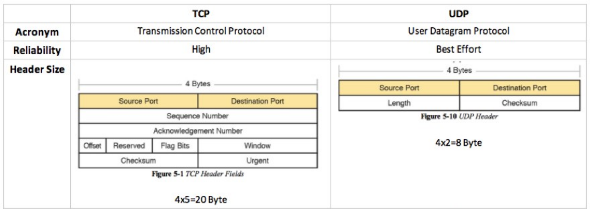

*TCP vs UDP — Header and feature comparison*


### Lab 13 — Follow datagrams and service refusal

Learning outcome: LO3.

Goal: UDP has no transport handshake or retransmission; the application may provide reliability.

**What you'll build**

Evidence CSV and packet findings   (Tools: Wireshark, TShark, Python.)

**Step-by-step**

1. Prepare your lab workspace. Open this lab folder in a terminal. Windows uses py -3 in place of python3. Wireshark GUI alone is sufficient for the investigation; CLI scripts require TShark on PATH. Run the fixture verification first.

   ```text
   python3 scripts/verify.py
   ```

2. Open data/branch-office.pcap. Apply udp.dstport == 9999. One frame is the original datagram and one is the UDP header quoted inside ICMP; inspect the outer protocol to distinguish them.
3. Select the original datagram and use Analyze > Follow > UDP Stream. Confirm the payload LAB-UDP. Save a text view to outputs/udp-stream.txt.
4. Apply udp.port == 4002 and decode RTP using Analyze > Decode As. Compare datagram framing with the earlier TCP stream.
5. Record why no UDP transport ACK exists in the trace. Use the ICMP refusal to explain why an application can fail even though a datagram was transmitted.
6. Export a reproducible packet table. Record the filter, frame numbers, measurement, explanation and limitation in outputs/findings.md.

   ```text
   python3 scripts/export_evidence.py
   ```


**Test it**

The supplied udp.dstport == 9999 expression matches 2 frame(s) in the specified capture. Run scripts/verify.py and compare the listed frame numbers. Keep your findings and exported table in outputs/. Explain the observed result rather than only copying a count.


*Lab 13 expected evidence — the packet list your filter should produce*

**Troubleshooting**

TShark not found: install Wireshark CLI tools and add the installation folder to PATH; on Windows use the Wireshark install directory. A filter returns zero: clear other filters, use the specified capture, and check the expression is in the display toolbar. TLS remains opaque: select the matching lab-tls.keys file by absolute path, reload, and remove a key-log preference from another lab.

**Challenge**

Develop and explain an alternative filter.

**Reflection**

Which second observation point would strengthen your conclusion?

> **Note:** Full commands are in labs/lab-13-*/README.md. Use the README in the matching labs/lab-NN-title/ folder. Capture only with permission.

---


## Topic 14 — TCP Protocol Analysis

Investigate retransmission and zero window

**Key concepts**

- Sequence numbers count bytes; ACK numbers indicate the next expected byte.
- Retransmission and duplicate ACK labels are heuristics sensitive to capture placement and completeness.
- Zero window indicates receive-side flow control; it is distinct from network congestion.

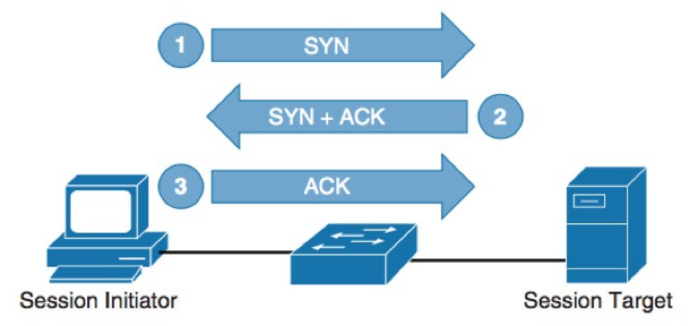

*The Three-Way Handshake — Connection establishment*


### Lab 14 — Investigate retransmission and zero window

Learning outcome: LO4.

Goal: Sequence numbers count bytes; ACK numbers indicate the next expected byte.

**What you'll build**

Evidence CSV and packet findings   (Tools: Wireshark, TShark, Python.)

**Step-by-step**

1. Prepare your lab workspace. Open this lab folder in a terminal. Windows uses py -3 in place of python3. Wireshark GUI alone is sufficient for the investigation; CLI scripts require TShark on PATH. Run the fixture verification first.

   ```text
   python3 scripts/verify.py
   ```

2. Open data/branch-office.pcap. Apply tcp.stream == 3. Open Analyze > Expert Information and note the repeated server segment.
3. Apply tcp.analysis.retransmission and expand TCP. Compare the same sequence range and payload in the earlier segment; the repeat occurs 1.000 second later.
4. Apply tcp.window_size_value == 0. Confirm the client ACK advertises zero receive window in stream 3. Examine the SYN options: window scaling is negotiated, but zero remains zero.
5. Apply tcp.flags.reset == 1. Identify the port 81 refusal. Complete assets/tcp-evidence.csv with stream, frame, flag/analysis, measured interval and a limitation. Discuss SACK, fast recovery and out-of-order evidence without claiming those events occur in this fixture.
6. Export a reproducible packet table. Record the filter, frame numbers, measurement, explanation and limitation in outputs/findings.md.

   ```text
   python3 scripts/export_evidence.py
   ```


**Test it**

The supplied tcp.analysis.retransmission expression matches 1 frame(s) in the specified capture. Run scripts/verify.py and compare the listed frame numbers. Keep your findings and exported table in outputs/. Explain the observed result rather than only copying a count.

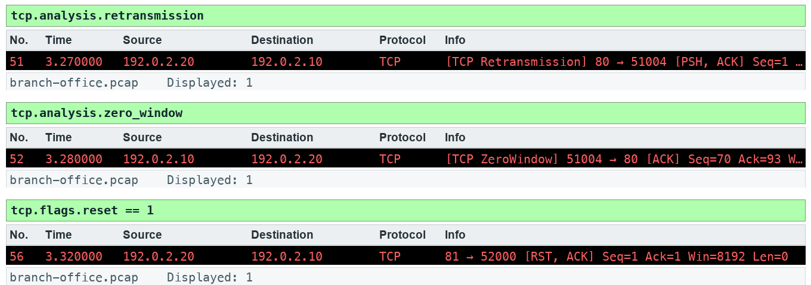

*Lab 14 expected evidence — the packet list your filter should produce*

**Troubleshooting**

TShark not found: install Wireshark CLI tools and add the installation folder to PATH; on Windows use the Wireshark install directory. A filter returns zero: clear other filters, use the specified capture, and check the expression is in the display toolbar. TLS remains opaque: select the matching lab-tls.keys file by absolute path, reload, and remove a key-log preference from another lab.

**Challenge**

Develop and explain an alternative filter.

**Reflection**

Which second observation point would strengthen your conclusion?

> **Note:** Full commands are in labs/lab-14-*/README.md. Use the README in the matching labs/lab-NN-title/ folder. Capture only with permission.

---


## Topic 15 — Traffic Graphs

Graph bytes, RTT and recovery

**Key concepts**

- An I/O graph bins observed events; units and interval determine what it means.
- TCP time-sequence graphs show byte progress, stalls and repeated sequence ranges.
- RTT samples, application response time and throughput answer different questions.

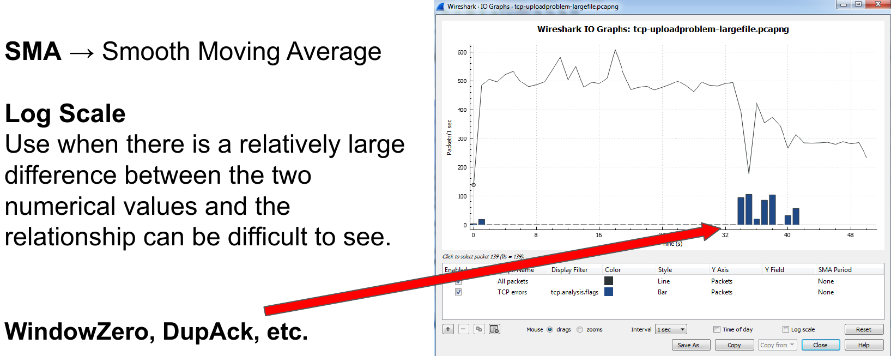

*I/O Graphs — Multiple graphs with different filters on one chart*


### Lab 15 — Graph bytes, RTT and recovery

Learning outcome: LO4.

Goal: An I/O graph bins observed events; units and interval determine what it means.

**What you'll build**

Evidence CSV and packet findings   (Tools: Wireshark, TShark, Python.)

**Step-by-step**

1. Prepare your lab workspace. Open this lab folder in a terminal. Windows uses py -3 in place of python3. Wireshark GUI alone is sufficient for the investigation; CLI scripts require TShark on PATH. Run the fixture verification first.

   ```text
   python3 scripts/verify.py
   ```

2. Open data/branch-office.pcap. Select a packet in TCP stream 3. Open Statistics > TCP Stream Graphs > Time Sequence (Stevens) and inspect the repeated server sequence.
3. Open Statistics > I/O Graphs. Add a retransmission graph with filter tcp.analysis.retransmission and a zero-window graph with filter tcp.analysis.zero_window. Use packets and a 1 second interval; record their event bins.
4. Open TCP Stream Graphs > Round Trip Time. Compare eligible ACK samples with the 30 ms SYN-to-SYN/ACK interval and the 40 ms complete handshake/initial_rtt on the final ACK. Explain why no ACK sample exists for an unacknowledged segment before its repeat.
5. Run the report script to export timestamps and byte lengths, then write outputs/graph-notes.md with interval, unit, stream, visible pattern and limitation. Do not use SUM(tcp.seq) as throughput.
6. Export a reproducible packet table. Record the filter, frame numbers, measurement, explanation and limitation in outputs/findings.md.

   ```text
   python3 scripts/export_evidence.py
   ```


**Test it**

The supplied tcp.analysis.retransmission || tcp.analysis.zero_window expression matches 2 frame(s) in the specified capture. Run scripts/verify.py and compare the listed frame numbers. Keep your findings and exported table in outputs/. Explain the observed result rather than only copying a count.


*Lab 15 expected evidence — the packet list your filter should produce*

**Troubleshooting**

TShark not found: install Wireshark CLI tools and add the installation folder to PATH; on Windows use the Wireshark install directory. A filter returns zero: clear other filters, use the specified capture, and check the expression is in the display toolbar. TLS remains opaque: select the matching lab-tls.keys file by absolute path, reload, and remove a key-log preference from another lab.

**Challenge**

Develop and explain an alternative filter.

**Reflection**

Which second observation point would strengthen your conclusion?

> **Note:** Full commands are in labs/lab-15-*/README.md. Use the README in the matching labs/lab-NN-title/ folder. Capture only with permission.

---


## Topic 16 — HTTP and HTTP/2 Analysis

Inspect HTTP outcomes and HTTP/2 frames

**Key concepts**

- HTTP response codes describe application outcomes after transport delivery.
- A response time contains more than network latency; pair the correct request and response.
- HTTP/2 multiplexes frames; encrypted HTTP/2 needs authorised TLS secrets to inspect payload.

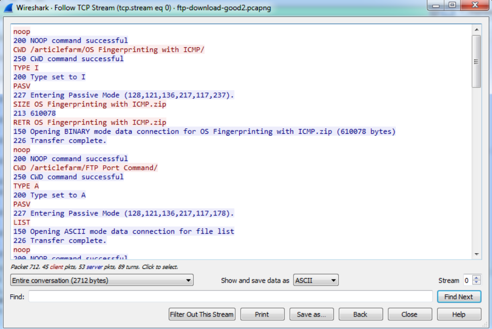

*Follow the Stream — Follow Stream reassembles the transferred data*


### Lab 16 — Inspect HTTP outcomes and HTTP/2 frames

Learning outcome: LO4.

Goal: HTTP response codes describe application outcomes after transport delivery.

**What you'll build**

Evidence CSV and packet findings   (Tools: Wireshark, TShark, Python.)

**Step-by-step**

1. Prepare your lab workspace. Open this lab folder in a terminal. Windows uses py -3 in place of python3. Wireshark GUI alone is sufficient for the investigation; CLI scripts require TShark on PATH. Run the fixture verification first.

   ```text
   python3 scripts/verify.py
   ```

2. Open data/branch-office.pcap. Apply http.request || http.response. Pair /health, /slow, /missing and /fault with their response codes.
3. Select the /health response and Follow > TCP Stream. Confirm LAB-OK. Use File > Export Objects > HTTP to save the health text object into outputs/objects/.
4. Apply tcp.port == 8080. Use Analyze > Decode As and set TCP port 8080 to HTTP2. Inspect the connection preface and SETTINGS frame (type 4). This fixture uses cleartext prior knowledge, not HTTPS.
5. Run scripts/verify.py, then save outputs/http-summary.csv with URI, status, response interval and proposed next step. Discuss how multiple HTTP/2 stream IDs share one TCP connection.
6. Export a reproducible packet table. Record the filter, frame numbers, measurement, explanation and limitation in outputs/findings.md.

   ```text
   python3 scripts/export_evidence.py
   ```


**Test it**

The supplied http.response.code >= 400 expression matches 2 frame(s) in the specified capture. Run scripts/verify.py and compare the listed frame numbers. Keep your findings and exported table in outputs/. Explain the observed result rather than only copying a count.


*Lab 16 expected evidence — the packet list your filter should produce*

**Troubleshooting**

TShark not found: install Wireshark CLI tools and add the installation folder to PATH; on Windows use the Wireshark install directory. A filter returns zero: clear other filters, use the specified capture, and check the expression is in the display toolbar. TLS remains opaque: select the matching lab-tls.keys file by absolute path, reload, and remove a key-log preference from another lab.

**Challenge**

Develop and explain an alternative filter.

**Reflection**

Which second observation point would strengthen your conclusion?

> **Note:** Full commands are in labs/lab-16-*/README.md. Use the README in the matching labs/lab-NN-title/ folder. Capture only with permission.

---


## Topic 17 — TLS-Encrypted Traffic Analysis

Compare encrypted and decrypted views

**Key concepts**

- Without session secrets, encrypted application records do not disclose HTTP payload.
- A controlled key log enables authorised inspection of this synthetic TLS exchange.
- A server RSA private key alone cannot decrypt modern ECDHE or TLS 1.3 sessions.


### Lab 17 — Compare encrypted and decrypted views

Learning outcome: LO4.

Goal: Without session secrets, encrypted application records do not disclose HTTP payload.

**What you'll build**

Evidence CSV and packet findings   (Tools: Wireshark, TShark, Python.)

**Step-by-step**

1. Prepare your lab workspace. Open this lab folder in a terminal. Windows uses py -3 in place of python3. Wireshark GUI alone is sufficient for the investigation; CLI scripts require TShark on PATH. Run the fixture verification first.

   ```text
   python3 scripts/verify.py
   ```

2. Open data/tls-session.pcap. In Preferences > Protocols > TLS, clear the (Pre)-Master-Secret log filename, then apply tls. Identify ClientHello and encrypted application records.
3. Expand ClientHello > Extensions > server_name. Record portal.example.test. The lab uses a real TLS 1.2 MemoryBIO exchange, a temporary self-signed certificate and offline synthetic TCP wrapping.
4. Set Preferences > Protocols > TLS > (Pre)-Master-Secret log filename to the absolute path of data/lab-tls.keys. Reload the capture. Apply http and confirm GET /health and 200 OK containing LAB-OK.
5. Run scripts/verify.py for both encrypted/decrypted checks. Clear the key-log preference when finished. The supplied secrets are synthetic lab session material; never copy production session secrets into a public repository.
6. Export a reproducible packet table. Record the filter, frame numbers, measurement, explanation and limitation in outputs/findings.md.

   ```text
   python3 scripts/export_evidence.py
   ```


**Test it**

The supplied tls.handshake.type == 1 expression matches 1 frame(s) in the specified capture. Run scripts/verify.py and compare the listed frame numbers. Keep your findings and exported table in outputs/. Explain the observed result rather than only copying a count.

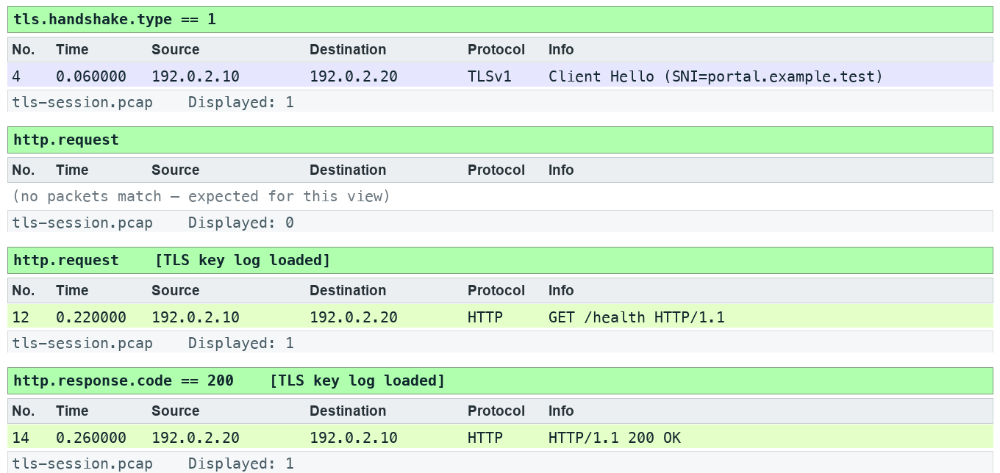

*Lab 17 expected evidence — the packet list your filter should produce*

**Troubleshooting**

TShark not found: install Wireshark CLI tools and add the installation folder to PATH; on Windows use the Wireshark install directory. A filter returns zero: clear other filters, use the specified capture, and check the expression is in the display toolbar. TLS remains opaque: select the matching lab-tls.keys file by absolute path, reload, and remove a key-log preference from another lab.

**Challenge**

Develop and explain an alternative filter.

**Reflection**

Which second observation point would strengthen your conclusion?

> **Note:** Full commands are in labs/lab-17-*/README.md. Use the README in the matching labs/lab-NN-title/ folder. Capture only with permission.

---


## Topic 18 — Ten Troubleshooting Steps and Reporting

Produce an evidence-led incident report

**Key concepts**

- Begin with scope and a baseline, then focus with endpoints, filters, time and graphs.
- Separate observed facts from hypotheses and specify what new evidence would test them.
- A useful report states affected flow, measurement, impact, recommended action and uncertainty.

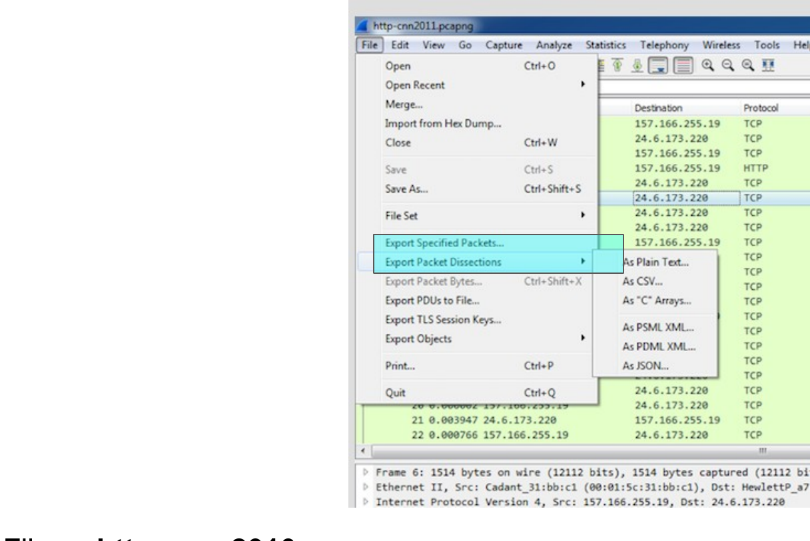

*Export and Preserve Evidence — File | Export Packet Dissections*


### Lab 18 — Produce an evidence-led incident report

Learning outcome: LO5.

Goal: Begin with scope and a baseline, then focus with endpoints, filters, time and graphs.

**What you'll build**

Evidence CSV and packet findings   (Tools: Wireshark, TShark, Python.)

**Step-by-step**

1. Prepare your lab workspace. Open this lab folder in a terminal. Windows uses py -3 in place of python3. Wireshark GUI alone is sufficient for the investigation; CLI scripts require TShark on PATH. Run the fixture verification first.

   ```text
   python3 scripts/verify.py
   ```

2. Open data/branch-office.pcap. Read assets/incident-ticket.md. Use Statistics > Conversations, filters and Expert Information to identify the failing /fault request.
3. Record evidence for the DNS delay, slow HTTP response, retransmission, zero window and port 81 refusal. Use exact frames and elapsed times rather than a claim that every symptom has one cause.
4. Complete assets/report-template.md and save as outputs/incident-report.md. Include scope, timeline, observations, competing explanations, next capture placement and a client-safe recommendation.
5. Use assets/ten-step-checklist.md to review the report. Re-run scripts/verify.py. Exchange reports with another learner and check that every conclusion can be traced to a packet or is explicitly a hypothesis.
6. Export a reproducible packet table. Record the filter, frame numbers, measurement, explanation and limitation in outputs/findings.md.

   ```text
   python3 scripts/export_evidence.py
   ```


**Test it**

The supplied http.response.code == 500 expression matches 1 frame(s) in the specified capture. Run scripts/verify.py and compare the listed frame numbers. Keep your findings and exported table in outputs/. Explain the observed result rather than only copying a count.


*Lab 18 expected evidence — the packet list your filter should produce*

**Troubleshooting**

TShark not found: install Wireshark CLI tools and add the installation folder to PATH; on Windows use the Wireshark install directory. A filter returns zero: clear other filters, use the specified capture, and check the expression is in the display toolbar. TLS remains opaque: select the matching lab-tls.keys file by absolute path, reload, and remove a key-log preference from another lab.

**Challenge**

Develop and explain an alternative filter.

**Reflection**

Which second observation point would strengthen your conclusion?

> **Note:** Full commands are in labs/lab-18-*/README.md. Use the README in the matching labs/lab-NN-title/ folder. Capture only with permission.

---


## Next Steps

- Repeat a lab with a fresh analyst profile.
- Use the ten-step checklist on a new authorised capture.
- Preserve packet numbers, filters and limitations in every report.


## Glossary

- **Capture filter** — libpcap expression limiting packets stored during capture.
- **Display filter** — Wireshark expression selecting stored packets for viewing.
- **iRTT** — Initial TCP round-trip sample from the handshake.
- **Retransmission** — Repeated TCP byte range; interpretation depends on capture completeness.
- **Zero window** — A receiver advertisement that no receive-buffer space is available.
- **TLS key log** — Per-session secrets permitting authorised decryption of the matching session.
- **SPAN** — Switch mirroring of selected traffic to a sensor port.
- **TAP** — An inline observation device supplying link traffic to a sensor.
