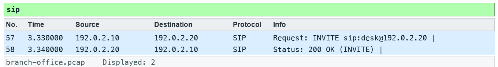

# Lab 06 — Summarize traffic and a voice stream

**Course:** Wireshark Network Analysis Masterclass (C1123) | **Topic:** 06 — Trace Statistics and VoIP Overview | **Learning outcome:** LO2 — Navigate, filter, summarize and time network exchanges. | **Time:** about 50 minutes | **Version:** v5.1 · 5 October 2026

## Scenario

Management wants a one-page summary of what crossed the branch link, including a test voice call that users said sounded choppy.

## Goal

Protocol Hierarchy shows captured composition; byte share differs from packet share.

## What you will produce

A traffic summary and RTP loss evidence.

## Before you start

- Wireshark 4.6 or later, with the TShark command-line tools on PATH.
- Python 3 for the verification and export scripts (Windows: use py -3 in place of python3).
- Open this lab folder in a terminal; every file the lab needs is inside it.
- Use only the supplied synthetic captures — do not capture on a network you are not authorised to monitor.

## Files for this lab

| File | What it is for |
|---|---|
| `data/branch-office.pcap` | Synthetic branch-office capture used by the lab |
| `assets/scenario.md` | The help-desk ticket that sets the scenario |
| `assets/checks.json` | Filters and frame counts the fixture must satisfy |
| `assets/expected-evidence.png` | The packet list your filter should produce |
| `scripts/verify.py` | Checks the capture facts with TShark |
| `scripts/export_evidence.py` | Exports this lab's evidence rows to outputs/evidence.csv |
| `outputs/findings.md` | Findings sheet you complete |

## Lab at a glance

1. Review Protocol Hierarchy and Conversations
2. Graph all traffic in bits per second
3. Identify the SIP INVITE and 200 OK
4. Decode RTP and find the missing sequence

## Step-by-step

1. Prepare your lab workspace. Open this lab folder in a terminal. Windows uses py -3 in place of python3. Wireshark GUI alone is sufficient for the investigation; CLI scripts require TShark on PATH. Run the fixture verification first.

   ```bash
   python3 scripts/verify.py
   ```

2. Open data/branch-office.pcap. Open Statistics > Protocol Hierarchy, then Statistics > Conversations. Sort TCP conversations by bytes; save the largest conversation details.

3. Open Statistics > I/O Graphs. Create an all-traffic graph with a 1 second interval and Bits as the unit. Record peak interval and explain the difference between observed bits and usable application throughput.

4. Apply sip and open Telephony > VoIP Calls or SIP Flows. Identify the INVITE and 200 OK. This minimal synthetic exchange is signalling evidence, not a complete production call.

5. Apply udp.port == 4002. Use Analyze > Decode As to decode this UDP port as RTP. Open Telephony > RTP > RTP Streams, select the stream and Analyze. Record sequence numbers 100, 101, 103, 104; the missing sequence is 102.

6. Export a reproducible packet table. Record the filter, frame numbers, measurement, explanation and limitation in outputs/findings.md.

   ```bash
   python3 scripts/export_evidence.py
   ```

## Expected evidence

With the lab filter applied, your packet list should match the frames below (produced by TShark from this lab's own capture).



## Test it

The supplied sip expression matches 2 frame(s) in the specified capture. Run scripts/verify.py and compare the listed frame numbers. Keep your findings and exported table in outputs/. Explain the observed result rather than only copying a count.

## Troubleshooting

- TShark not found: install Wireshark CLI tools and add the installation folder to PATH; on Windows use the Wireshark install directory.
- A filter returns zero: clear other filters, use the specified capture, and check the expression is in the display toolbar.
- TLS remains opaque: select the matching lab-tls.keys file by absolute path, reload, and remove a key-log preference from another lab.

## Try it with TShark

The same evidence from the command line — run it from this lab folder:

```bash
tshark -n -r data/branch-office.pcap -q -z io,phs
```

## Challenge

Develop and explain an alternative filter.

## Reflection

Which second observation point would strengthen your conclusion?

## Extension (optional)

Analyse a longer SIP/RTP call from the Wireshark sample captures (wiki.wireshark.org/SampleCaptures) with Telephony > VoIP Calls.

## Reset

Clear all display filters and return to the C1123-Analyst or Default profile. If you loaded a TLS key log, remove it from Preferences > Protocols > TLS. The supplied captures never need regenerating for the core lab.

> **Note:** The same steps appear in the Learner Guide. The slides show only the scenario and a summary.

---

*Wireshark Network Analysis Masterclass · C1123 · Version v5.1 · © 2026 Tertiary Infotech Academy Pte Ltd*
