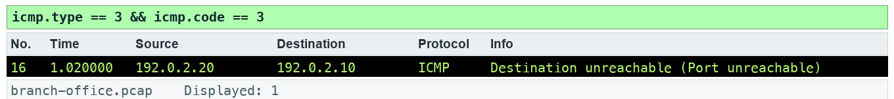

# Lab 12 — Interpret echo and unreachable messages

**Course:** Wireshark Network Analysis Masterclass (C1123) | **Topic:** 12 — ICMP Traffic Analysis | **Learning outcome:** LO3 — Interpret DNS, ARP, IPv4, ICMP and UDP evidence. | **Time:** about 30 minutes | **Version:** v5.1 · 5 October 2026

## Scenario

Ping to the server works, yet a diagnostic tool on UDP port 9999 fails. You use ICMP evidence to explain the difference.

## Goal

Echo requests/replies show an IP exchange; they do not guarantee an application works.

## What you will produce

An ICMP event log explaining the service refusal.

## Before you start

- Wireshark 4.6 or later, with the TShark command-line tools on PATH.
- Python 3 for the verification and export scripts (Windows: use py -3 in place of python3).
- Open this lab folder in a terminal; every file the lab needs is inside it.
- Use only the supplied synthetic captures — do not capture on a network you are not authorised to monitor.

## Files for this lab

| File | What it is for |
|---|---|
| `data/branch-office.pcap` | Synthetic branch-office capture used by the lab |
| `assets/scenario.md` | The help-desk ticket that sets the scenario |
| `assets/checks.json` | Filters and frame counts the fixture must satisfy |
| `assets/expected-evidence.png` | The packet list your filter should produce |
| `scripts/verify.py` | Checks the capture facts with TShark |
| `scripts/export_evidence.py` | Exports this lab's evidence rows to outputs/evidence.csv |
| `outputs/findings.md` | Findings sheet you complete |
| `assets/icmp-events.csv` | ICMP event log you complete |

## Lab at a glance

1. Pair echo requests and replies
2. Read the quoted headers in the unreachable
3. Find the original UDP datagram
4. Record the events and your conclusion

## Step-by-step

1. Prepare your lab workspace. Open this lab folder in a terminal. Windows uses py -3 in place of python3. Wireshark GUI alone is sufficient for the investigation; CLI scripts require TShark on PATH. Run the fixture verification first.

   ```bash
   python3 scripts/verify.py
   ```

2. Open data/branch-office.pcap. Apply icmp.type == 8 || icmp.type == 0. Pair echo sequences 0, 1 and 2 using identifier 7. Measure 0.030 seconds per pair.

3. Apply icmp.type == 3 && icmp.code == 3. Expand the quoted IPv4 and UDP headers. Record destination UDP port 9999.

4. Apply udp.dstport == 9999 to locate the initiating datagram. Record the difference between a UDP service refusal and an echo reply.

5. Complete assets/icmp-events.csv with type, code, quoted protocol, port and conclusion. State which evidence supports a service refusal.

6. Export a reproducible packet table. Record the filter, frame numbers, measurement, explanation and limitation in outputs/findings.md.

   ```bash
   python3 scripts/export_evidence.py
   ```

## Expected evidence

With the lab filter applied, your packet list should match the frames below (produced by TShark from this lab's own capture).



## Test it

The supplied icmp.type == 3 && icmp.code == 3 expression matches 1 frame(s) in the specified capture. Run scripts/verify.py and compare the listed frame numbers. Keep your findings and exported table in outputs/. Explain the observed result rather than only copying a count.

## Troubleshooting

- TShark not found: install Wireshark CLI tools and add the installation folder to PATH; on Windows use the Wireshark install directory.
- A filter returns zero: clear other filters, use the specified capture, and check the expression is in the display toolbar.
- TLS remains opaque: select the matching lab-tls.keys file by absolute path, reload, and remove a key-log preference from another lab.

## Try it with TShark

The same evidence from the command line — run it from this lab folder:

```bash
tshark -n -r data/branch-office.pcap -Y icmp -T fields -e frame.number -e icmp.type -e icmp.code -e icmp.seq
```

## Challenge

Develop and explain an alternative filter.

## Reflection

Which second observation point would strengthen your conclusion?

## Extension (optional)

ICMP lab — identify Time Exceeded (type 11) messages in the traceroute trace. Source: J.F. Kurose and K.W. Ross, Wireshark Labs (gaia.cs.umass.edu/kurose_ross/wireshark.php).

## Reset

Clear all display filters and return to the C1123-Analyst or Default profile. If you loaded a TLS key log, remove it from Preferences > Protocols > TLS. The supplied captures never need regenerating for the core lab.

> **Note:** The same steps appear in the Learner Guide. The slides show only the scenario and a summary.

---

*Wireshark Network Analysis Masterclass · C1123 · Version v5.1 · © 2026 Tertiary Infotech Academy Pte Ltd*
