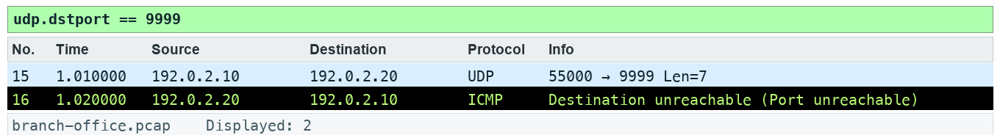

# Lab 13 — Follow datagrams and service refusal

**Course:** Wireshark Network Analysis Masterclass (C1123) | **Topic:** 13 — UDP Traffic Analysis | **Learning outcome:** LO3 — Interpret DNS, ARP, IPv4, ICMP and UDP evidence. | **Time:** about 30 minutes | **Version:** v5.1 · 5 October 2026

## Scenario

The diagnostic application sends UDP and never hears back. You follow the datagrams to show what was sent and why there is no transport-level acknowledgement.

## Goal

UDP has no transport handshake or retransmission; the application may provide reliability.

## What you will produce

A saved UDP stream and an explanation of the refusal.

## Before you start

- Wireshark 4.6 or later, with the TShark command-line tools on PATH.
- Python 3 for the verification and export scripts (Windows: use py -3 in place of python3).
- Open this lab folder in a terminal; every file the lab needs is inside it.
- Use only the supplied synthetic captures — do not capture on a network you are not authorised to monitor.

## Files for this lab

| File | What it is for |
|---|---|
| `data/branch-office.pcap` | Synthetic branch-office capture used by the lab |
| `assets/scenario.md` | The help-desk ticket that sets the scenario |
| `assets/checks.json` | Filters and frame counts the fixture must satisfy |
| `assets/expected-evidence.png` | The packet list your filter should produce |
| `scripts/verify.py` | Checks the capture facts with TShark |
| `scripts/export_evidence.py` | Exports this lab's evidence rows to outputs/evidence.csv |
| `outputs/findings.md` | Findings sheet you complete |

## Lab at a glance

1. Tell the datagram from its ICMP quote
2. Follow the UDP stream (LAB-UDP)
3. Decode the RTP stream on port 4002
4. Explain the refusal without UDP ACKs

## Step-by-step

1. Prepare your lab workspace. Open this lab folder in a terminal. Windows uses py -3 in place of python3. Wireshark GUI alone is sufficient for the investigation; CLI scripts require TShark on PATH. Run the fixture verification first.

   ```bash
   python3 scripts/verify.py
   ```

2. Open data/branch-office.pcap. Apply udp.dstport == 9999. One frame is the original datagram and one is the UDP header quoted inside ICMP; inspect the outer protocol to distinguish them.

3. Select the original datagram and use Analyze > Follow > UDP Stream. Confirm the payload LAB-UDP. Save a text view to outputs/udp-stream.txt.

4. Apply udp.port == 4002 and decode RTP using Analyze > Decode As. Compare datagram framing with the earlier TCP stream.

5. Record why no UDP transport ACK exists in the trace. Use the ICMP refusal to explain why an application can fail even though a datagram was transmitted.

6. Export a reproducible packet table. Record the filter, frame numbers, measurement, explanation and limitation in outputs/findings.md.

   ```bash
   python3 scripts/export_evidence.py
   ```

## Expected evidence

With the lab filter applied, your packet list should match the frames below (produced by TShark from this lab's own capture).



## Test it

The supplied udp.dstport == 9999 expression matches 2 frame(s) in the specified capture. Run scripts/verify.py and compare the listed frame numbers. Keep your findings and exported table in outputs/. Explain the observed result rather than only copying a count.

## Troubleshooting

- TShark not found: install Wireshark CLI tools and add the installation folder to PATH; on Windows use the Wireshark install directory.
- A filter returns zero: clear other filters, use the specified capture, and check the expression is in the display toolbar.
- TLS remains opaque: select the matching lab-tls.keys file by absolute path, reload, and remove a key-log preference from another lab.

## Try it with TShark

The same evidence from the command line — run it from this lab folder:

```bash
tshark -n -r data/branch-office.pcap -q -z follow,udp,ascii,3
```

## Challenge

Develop and explain an alternative filter.

## Reflection

Which second observation point would strengthen your conclusion?

## Extension (optional)

UDP lab — examine UDP header fields and lengths in the UDP trace from the Kurose & Ross labs. Source: J.F. Kurose and K.W. Ross, Wireshark Labs (gaia.cs.umass.edu/kurose_ross/wireshark.php).

## Reset

Clear all display filters and return to the C1123-Analyst or Default profile. If you loaded a TLS key log, remove it from Preferences > Protocols > TLS. The supplied captures never need regenerating for the core lab.

> **Note:** The same steps appear in the Learner Guide. The slides show only the scenario and a summary.

---

*Wireshark Network Analysis Masterclass · C1123 · Version v5.1 · © 2026 Tertiary Infotech Academy Pte Ltd*
