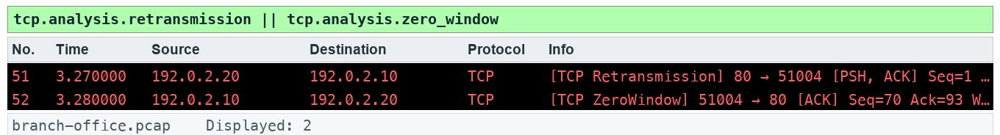

# Lab 15 — Graph bytes, RTT and recovery

**Course:** Wireshark Network Analysis Masterclass (C1123) | **Topic:** 15 — Traffic Graphs | **Learning outcome:** LO4 — Diagnose TCP and application behaviour, including HTTP and authorised TLS inspection. | **Time:** about 50 minutes | **Version:** v5.1 · 5 October 2026

## Scenario

Management wants a picture, not a packet list. You graph the stalled transfer so the retransmission and zero-window events are obvious.

## Goal

An I/O graph bins observed events; units and interval determine what it means.

## What you will produce

Graph notes with interval, unit, stream and limitation.

## Before you start

- Wireshark 4.6 or later, with the TShark command-line tools on PATH.
- Python 3 for the verification and export scripts (Windows: use py -3 in place of python3).
- Open this lab folder in a terminal; every file the lab needs is inside it.
- Use only the supplied synthetic captures — do not capture on a network you are not authorised to monitor.

## Files for this lab

| File | What it is for |
|---|---|
| `data/branch-office.pcap` | Synthetic branch-office capture used by the lab |
| `assets/scenario.md` | The help-desk ticket that sets the scenario |
| `assets/checks.json` | Filters and frame counts the fixture must satisfy |
| `assets/expected-evidence.png` | The packet list your filter should produce |
| `scripts/verify.py` | Checks the capture facts with TShark |
| `scripts/export_evidence.py` | Exports this lab's evidence rows to outputs/evidence.csv |
| `outputs/findings.md` | Findings sheet you complete |
| `assets/graph-notes-template.md` | Graph notes template |

## Lab at a glance

1. Open the Stevens time/sequence graph
2. Graph retransmission and zero-window events
3. Compare RTT samples with the handshake
4. Write graph notes with units and limits

## Step-by-step

1. Prepare your lab workspace. Open this lab folder in a terminal. Windows uses py -3 in place of python3. Wireshark GUI alone is sufficient for the investigation; CLI scripts require TShark on PATH. Run the fixture verification first.

   ```bash
   python3 scripts/verify.py
   ```

2. Open data/branch-office.pcap. Select a packet in TCP stream 3. Open Statistics > TCP Stream Graphs > Time Sequence (Stevens) and inspect the repeated server sequence.

3. Open Statistics > I/O Graphs. Add a retransmission graph with filter tcp.analysis.retransmission and a zero-window graph with filter tcp.analysis.zero_window. Use packets and a 1 second interval; record their event bins.

4. Open TCP Stream Graphs > Round Trip Time. Compare eligible ACK samples with the 30 ms SYN-to-SYN/ACK interval and the 40 ms complete handshake/initial_rtt on the final ACK. Explain why no ACK sample exists for an unacknowledged segment before its repeat.

5. Run the report script to export timestamps and byte lengths, then write outputs/graph-notes.md with interval, unit, stream, visible pattern and limitation. Do not use SUM(tcp.seq) as throughput.

6. Export a reproducible packet table. Record the filter, frame numbers, measurement, explanation and limitation in outputs/findings.md.

   ```bash
   python3 scripts/export_evidence.py
   ```

## Expected evidence

With the lab filter applied, your packet list should match the frames below (produced by TShark from this lab's own capture).



## Test it

The supplied tcp.analysis.retransmission || tcp.analysis.zero_window expression matches 2 frame(s) in the specified capture. Run scripts/verify.py and compare the listed frame numbers. Keep your findings and exported table in outputs/. Explain the observed result rather than only copying a count.

## Troubleshooting

- TShark not found: install Wireshark CLI tools and add the installation folder to PATH; on Windows use the Wireshark install directory.
- A filter returns zero: clear other filters, use the specified capture, and check the expression is in the display toolbar.
- TLS remains opaque: select the matching lab-tls.keys file by absolute path, reload, and remove a key-log preference from another lab.

## Try it with TShark

The same evidence from the command line — run it from this lab folder:

```bash
tshark -n -r data/branch-office.pcap -q -z "io,stat,1,tcp.analysis.retransmission,tcp.analysis.zero_window"
```

## Challenge

Develop and explain an alternative filter.

## Reflection

Which second observation point would strengthen your conclusion?

## Extension (optional)

TCP lab — draw the Stevens graph of the file upload trace and estimate throughput. Source: J.F. Kurose and K.W. Ross, Wireshark Labs (gaia.cs.umass.edu/kurose_ross/wireshark.php).

## Reset

Clear all display filters and return to the C1123-Analyst or Default profile. If you loaded a TLS key log, remove it from Preferences > Protocols > TLS. The supplied captures never need regenerating for the core lab.

> **Note:** The same steps appear in the Learner Guide. The slides show only the scenario and a summary.

---

*Wireshark Network Analysis Masterclass · C1123 · Version v5.1 · © 2026 Tertiary Infotech Academy Pte Ltd*
