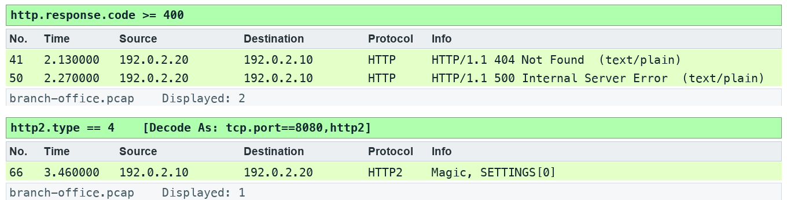

# Lab 16 — Inspect HTTP outcomes and HTTP/2 frames

**Course:** Wireshark Network Analysis Masterclass (C1123) | **Topic:** 16 — HTTP and HTTP/2 Analysis | **Learning outcome:** LO4 — Diagnose TCP and application behaviour, including HTTP and authorised TLS inspection. | **Time:** about 75 minutes | **Version:** v5.1 · 5 October 2026

## Scenario

The web team wants to know which pages fail and whether the new HTTP/2 test service is negotiating correctly.

## Goal

HTTP response codes describe application outcomes after transport delivery.

## What you will produce

An HTTP outcome summary and an exported object.

## Before you start

- Wireshark 4.6 or later, with the TShark command-line tools on PATH.
- Python 3 for the verification and export scripts (Windows: use py -3 in place of python3).
- Open this lab folder in a terminal; every file the lab needs is inside it.
- Use only the supplied synthetic captures — do not capture on a network you are not authorised to monitor.

## Files for this lab

| File | What it is for |
|---|---|
| `data/branch-office.pcap` | Synthetic branch-office capture used by the lab |
| `assets/scenario.md` | The help-desk ticket that sets the scenario |
| `assets/checks.json` | Filters and frame counts the fixture must satisfy |
| `assets/expected-evidence.png` | The packet list your filter should produce |
| `scripts/verify.py` | Checks the capture facts with TShark |
| `scripts/export_evidence.py` | Exports this lab's evidence rows to outputs/evidence.csv |
| `outputs/findings.md` | Findings sheet you complete |
| `assets/http-summary.csv` | HTTP summary template |

## Lab at a glance

1. Pair four URIs with their status codes
2. Follow the stream and export an object
3. Decode port 8080 as HTTP/2
4. Summarise outcomes and next steps

## Step-by-step

1. Prepare your lab workspace. Open this lab folder in a terminal. Windows uses py -3 in place of python3. Wireshark GUI alone is sufficient for the investigation; CLI scripts require TShark on PATH. Run the fixture verification first.

   ```bash
   python3 scripts/verify.py
   ```

2. Open data/branch-office.pcap. Apply http.request || http.response. Pair /health, /slow, /missing and /fault with their response codes.

3. Select the /health response and Follow > TCP Stream. Confirm LAB-OK. Use File > Export Objects > HTTP to save the health text object into outputs/objects/.

4. Apply tcp.port == 8080. Use Analyze > Decode As and set TCP port 8080 to HTTP2. Inspect the connection preface and SETTINGS frame (type 4). This fixture uses cleartext prior knowledge, not HTTPS.

5. Run scripts/verify.py, then save outputs/http-summary.csv with URI, status, response interval and proposed next step. Discuss how multiple HTTP/2 stream IDs share one TCP connection.

6. Export a reproducible packet table. Record the filter, frame numbers, measurement, explanation and limitation in outputs/findings.md.

   ```bash
   python3 scripts/export_evidence.py
   ```

## Expected evidence

With the lab filter applied, your packet list should match the frames below (produced by TShark from this lab's own capture).



## Test it

The supplied http.response.code >= 400 expression matches 2 frame(s) in the specified capture. Run scripts/verify.py and compare the listed frame numbers. Keep your findings and exported table in outputs/. Explain the observed result rather than only copying a count.

## Troubleshooting

- TShark not found: install Wireshark CLI tools and add the installation folder to PATH; on Windows use the Wireshark install directory.
- A filter returns zero: clear other filters, use the specified capture, and check the expression is in the display toolbar.
- TLS remains opaque: select the matching lab-tls.keys file by absolute path, reload, and remove a key-log preference from another lab.

## Try it with TShark

The same evidence from the command line — run it from this lab folder:

```bash
tshark -n -r data/branch-office.pcap -q --export-objects http,outputs/objects
```

## Challenge

Develop and explain an alternative filter.

## Reflection

Which second observation point would strengthen your conclusion?

## Extension (optional)

HTTP lab — compare conditional GET (304) behaviour in the HTTP traces. Hash every exported object with shasum -a 256. Source: J.F. Kurose and K.W. Ross, Wireshark Labs (gaia.cs.umass.edu/kurose_ross/wireshark.php).

## Reset

Clear all display filters and return to the C1123-Analyst or Default profile. If you loaded a TLS key log, remove it from Preferences > Protocols > TLS. The supplied captures never need regenerating for the core lab.

> **Note:** The same steps appear in the Learner Guide. The slides show only the scenario and a summary.

---

*Wireshark Network Analysis Masterclass · C1123 · Version v5.1 · © 2026 Tertiary Infotech Academy Pte Ltd*
