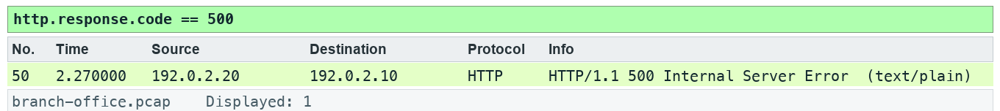

# Lab 18 — Produce an evidence-led incident report

**Course:** Wireshark Network Analysis Masterclass (C1123) | **Topic:** 18 — Ten Troubleshooting Steps and Reporting | **Learning outcome:** LO5 — Report observed facts, hypotheses and next actions with defensible evidence. | **Time:** about 75 minutes | **Version:** v5.1 · 5 October 2026

## Scenario

Ticket BR-104 combines several user complaints. You produce a reproducible incident report that separates observed facts from hypotheses.

## Goal

Begin with scope and a baseline, then focus with endpoints, filters, time and graphs.

## What you will produce

An evidence-led incident report.

## Before you start

- Wireshark 4.6 or later, with the TShark command-line tools on PATH.
- Python 3 for the verification and export scripts (Windows: use py -3 in place of python3).
- Open this lab folder in a terminal; every file the lab needs is inside it.
- Use only the supplied synthetic captures — do not capture on a network you are not authorised to monitor.

## Files for this lab

| File | What it is for |
|---|---|
| `data/branch-office.pcap` | Synthetic branch-office capture used by the lab |
| `assets/scenario.md` | The help-desk ticket that sets the scenario |
| `assets/checks.json` | Filters and frame counts the fixture must satisfy |
| `assets/expected-evidence.png` | The packet list your filter should produce |
| `scripts/verify.py` | Checks the capture facts with TShark |
| `scripts/export_evidence.py` | Exports this lab's evidence rows to outputs/evidence.csv |
| `outputs/findings.md` | Findings sheet you complete |
| `assets/incident-ticket.md` | Incident ticket BR-104 |
| `assets/report-template.md` | Report template |
| `assets/ten-step-checklist.md` | Ten-step review checklist |

## Lab at a glance

1. Read the incident ticket
2. Collect evidence for each symptom
3. Write the report from the template
4. Peer-review with the ten-step checklist

## Step-by-step

1. Prepare your lab workspace. Open this lab folder in a terminal. Windows uses py -3 in place of python3. Wireshark GUI alone is sufficient for the investigation; CLI scripts require TShark on PATH. Run the fixture verification first.

   ```bash
   python3 scripts/verify.py
   ```

2. Open data/branch-office.pcap. Read assets/incident-ticket.md. Use Statistics > Conversations, filters and Expert Information to identify the failing /fault request.

3. Record evidence for the DNS delay, slow HTTP response, retransmission, zero window and port 81 refusal. Use exact frames and elapsed times rather than a claim that every symptom has one cause.

4. Complete assets/report-template.md and save as outputs/incident-report.md. Include scope, timeline, observations, competing explanations, next capture placement and a client-safe recommendation.

5. Use assets/ten-step-checklist.md to review the report. Re-run scripts/verify.py. Exchange reports with another learner and check that every conclusion can be traced to a packet or is explicitly a hypothesis.

6. Export a reproducible packet table. Record the filter, frame numbers, measurement, explanation and limitation in outputs/findings.md.

   ```bash
   python3 scripts/export_evidence.py
   ```

## Expected evidence

With the lab filter applied, your packet list should match the frames below (produced by TShark from this lab's own capture).



## Test it

The supplied http.response.code == 500 expression matches 1 frame(s) in the specified capture. Run scripts/verify.py and compare the listed frame numbers. Keep your findings and exported table in outputs/. Explain the observed result rather than only copying a count.

## Troubleshooting

- TShark not found: install Wireshark CLI tools and add the installation folder to PATH; on Windows use the Wireshark install directory.
- A filter returns zero: clear other filters, use the specified capture, and check the expression is in the display toolbar.
- TLS remains opaque: select the matching lab-tls.keys file by absolute path, reload, and remove a key-log preference from another lab.

## Try it with TShark

The same evidence from the command line — run it from this lab folder:

```bash
tshark -n -r data/branch-office.pcap -q -z conv,tcp
```

## Challenge

Develop and explain an alternative filter.

## Reflection

Which second observation point would strengthen your conclusion?

## Extension (optional)

Write a second incident report from a capture in the Wireshark sample captures (wiki.wireshark.org/SampleCaptures), using the same template and checklist.

## Reset

Clear all display filters and return to the C1123-Analyst or Default profile. If you loaded a TLS key log, remove it from Preferences > Protocols > TLS. The supplied captures never need regenerating for the core lab.

> **Note:** The same steps appear in the Learner Guide. The slides show only the scenario and a summary.

---

*Wireshark Network Analysis Masterclass · C1123 · Version v5.1 · © 2026 Tertiary Infotech Academy Pte Ltd*
